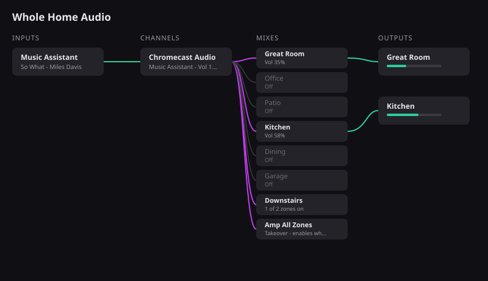

# Music Flow Card

A custom Lovelace card for Home Assistant that shows whole-home audio as a
signal path and lets you route it with taps, modeled on the Audio Flow view
in Elgato Wave Link 3.3. One card answers four questions in order: what is
playing, where is it streaming, which zones should hear it, and how loud is
each zone right now.

The card was built for this topology, and generalizes to any setup with the
same shape (a source player, a cast target, and source-selectable zones):

```
Music Assistant  -->  Chromecast Audio  --optical split-->  Yamaha RX-A3080 zones
                                                       \->  Monoprice 6-zone amp zones
```



*This is a hand-drawn illustration of the layout, not a screen capture; run
`npm run dev` for the real dev harness.*

## The four columns

| Column | Shows | Tap |
| --- | --- | --- |
| Inputs | The Music Assistant player with current track | Opens an in-card media browser; picking an item plays it |
| Channels | The Chromecast the music streams to | Traces its signal path |
| Mixes | Every zone, group helper, and amp master | Routes audio: powers the zone on and selects the Chromecast feed input; tap again to power off |
| Outputs | Only the zones playing right now | Volume slider, mute, and readout per zone |

Clicking any node traces its full path in the stage colors (source to
stream, stream to zone, zone to output) and dims everything else, exactly
like the reference design. Escape or the Clear selection button resets.
Muted stages render as dashed links. Long-press any node for the standard
more-info dialog.

## How routing works

Home Assistant cannot see the physical wiring between the Chromecast and
the receivers, so the card derives it from configuration:

- `feed_aliases` lists every source name that carries the Chromecast feed
  ("AUDIO2" on the Yamaha, "Source 2" on the Monoprice). A zone whose
  `source_list` contains one of the aliases resolves automatically, so you
  do not have to fix dissimilar naming device by device.
- A zone is **in the signal path** when it is powered on and its `source`
  matches its resolved feed name. A source of `None` or the literal
  `Unknown` never matches; a zone that is on with a different source
  renders half-bright with its actual source shown.
- Activating a zone calls `media_player.turn_on`, waits briefly (receivers
  coming out of standby can ignore an instant input change), then
  `media_player.select_source` with the resolved feed name.

### Groups

Group nodes bind to Home Assistant **media player group helpers**. The
helper fans out power natively; the card additionally sets each configured
member zone to its feed source. A partial group shows "n of m zones on"
and tapping it completes the group instead of restarting it. Helper
members that are not configured as card zones are ignored for path state,
because the card cannot know their feed source.

### Masters (takeover)

Master nodes are for entities whose commands fan out to a whole unit in
device firmware, such as the Monoprice master zones (10, 20, 30). One tap
enables all six zones of the unit and sets their source at once. Child
zone entities only confirm on the integration's next poll, up to five
seconds later; the card shows the expected state with a pending spinner
until the devices confirm.

### Optimistic display, honestly labeled

Every tap renders its expected result immediately, marked with a spinner
until the device confirms. If a device never confirms within
`optimistic_ttl` (default 8 seconds, sized for the Monoprice 5 second
poll), the expectation is dropped and the card shows device truth again.
What you see during the pending window is intent, not confirmed state.

## Installation

The built card is delivered two ways, and HACS accepts either: as an
asset named `music-flow-card.js` on each GitHub Release, and as a
committed `dist/music-flow-card.js` in the repository tree. HACS prefers
the release asset and falls back to the committed dist; CI fails if the
committed file ever drifts from a fresh build of the source.

**HACS (custom repository):**

1. HACS, three-dot menu, Custom repositories.
2. Repository `https://github.com/trooperthorn/ha_card_music`, type
   Dashboard.
3. Install Music Flow Card. HACS registers the resource automatically.

**Manual:** download `music-flow-card.js` from the latest release into
`config/www/`, then add `/local/music-flow-card.js` as a dashboard
resource of type JavaScript module.

## Configuration

There is no visual editor in this version; configure in YAML. Invalid
configuration makes `setConfig` throw, as the Home Assistant custom card
contract documents, and the error message lists every collected problem
at once so the configuration can be fixed in one edit. A missing entity
at runtime marks only that node with a badge; the rest of the card keeps
working.

| Option | Required | Description |
| --- | --- | --- |
| `input.entity` | yes | Music Assistant media_player |
| `channel.entity` | yes | The Chromecast (Google Cast) media_player |
| `feed_aliases` | no | Source names that count as the Chromecast feed on any device |
| `zones` | yes | List of zone media_players, see below |
| `groups` | no | List of media_player group helper entities |
| `masters` | no | List of firmware fan-out entities (takeover nodes) |
| `title` | no | Card header |
| `columns` | no | Override the pill labels (`inputs`, `channels`, `mixes`, `outputs`) |
| `colors` | no | Override path colors (`input_link`, `channel_link`, `output_link`) |
| `optimistic_ttl` | no | Milliseconds before an unconfirmed tap is dropped, default 8000 |

Per zone:

| Option | Required | Description |
| --- | --- | --- |
| `entity` | yes | The zone media_player |
| `feed_source` | if no alias covers it | Exact source name carrying the feed on this device |
| `name`, `icon` | no | Display overrides |
| `volume.display` | no | `percent` (default), `raw`, or `db` |
| `volume.max` | with `raw` | Device full-scale steps, 38 for Monoprice |
| `volume.entity` | with `db` | A number entity holding the exact dB value |

Masters accept `entity`, `feed_source`, `name`, and `icon`; groups accept
`entity`, `name`, and `icon`.

See `examples/minimal.yaml` and `examples/rx-a3080-monoprice.yaml` for a
minimal and a complete worked configuration. Both integrations this card
was built against derive entity ids from names that users rename, so
always paste your real entity ids; the card never guesses.

## Development

```
npm ci
npm run dev        # harness at http://localhost:5173 with a mock hass
npm test           # vitest over config parsing, derivation, pending store
npm run lint
npm run typecheck
npm run build      # dist/music-flow-card.js, single self-contained file
```

The dev harness simulates the important device behaviors without
hardware: Monoprice-shaped entities confirm service calls after five
seconds, everything else after 300 ms, and the media browser serves a
canned tree. Scenario buttons cover all-off, playing, cast off, an
unavailable zone, an unknown source, a partial group, and a broken
configuration.

## Versioning and releases

Versions are CalVer `YYYY.MM.DD.N` with a `v` prefix on tags. The root `VERSION`
file is the single source of truth: the build stamps it into the console banner,
`.release.json` names it as the shipped version field, and the Release workflow
refuses to publish when a fresh build of `dist/music-flow-card.js` differs from
the committed one. `package.json` stays at an inert `0.0.0` because npm requires
SemVer there.

A merge to `main` is the only release path. `Release` runs on every push to
`main`: it validates `VERSION`, rebuilds the card and checks the committed dist
matches, creates the tag, drafts the release with `dist/music-flow-card.js`
attached, and publishes it; a version that is already published is left alone.
`Prepare release` runs after every successful `Release` and, when release-bearing
files changed since the last tag, writes the next version into `VERSION`,
rebuilds `dist`, and opens an auto-merging PR through the release GitHub App
(variable `RELEASE_AUTOMATION_CLIENT_ID`, secret `RELEASE_AUTOMATION_PRIVATE_KEY`).
Without those credentials, bump `VERSION` with
`python scripts/set_version.py --next-from-tags`, run `npm run build`, commit
both, and open a PR; the merge publishes.

## Verified and unverified

Labeled per the house rule: state only what has been looked up.

Verified in the mock harness and unit tests:

- Path derivation, alias resolution, group and master state, selection
  tracing, optimistic confirm and TTL expiry, configuration validation,
  browse and play round trip against the documented WebSocket command.

Verified against the HACS source (`repositories/plugin.py`): for a
plugin with `filename` set, HACS looks for the file in the latest
release's assets, then in the validated tree at the root or `dist/`.
Both delivery paths in this repository satisfy that check.

Not yet verified on a live install (check these on first use):

- HACS accepting this repository end to end after the first release
  carries the asset (the initial attempt failed because the release had
  no assets and dist was not committed).
- `media_player/browse_media` against a real Music Assistant player.
- Source string matching against receiver-side renamed inputs.
- The turn_on to select_source settle delay on a standby yamaha_ynca zone.
- Monoprice master fan-out timing against the real 5 second poll.
- The more-info event from inside the card on current Home Assistant.

See [docs/README.md](docs/README.md) for dated design decisions.
